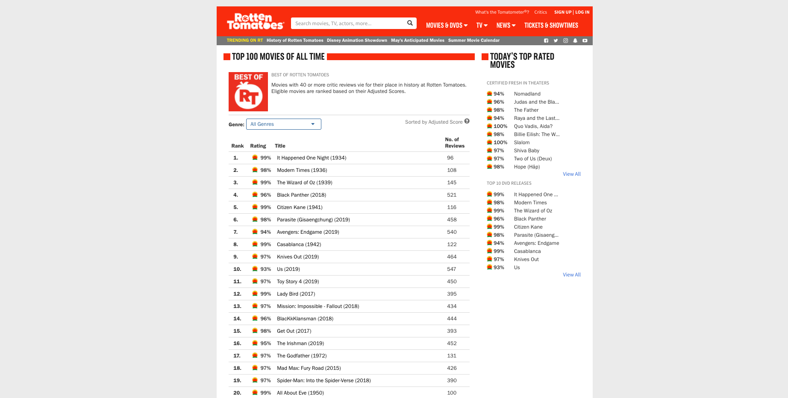
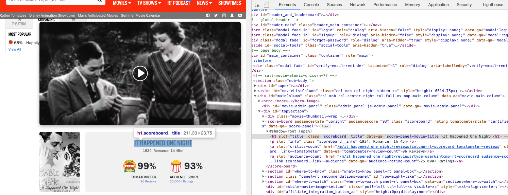
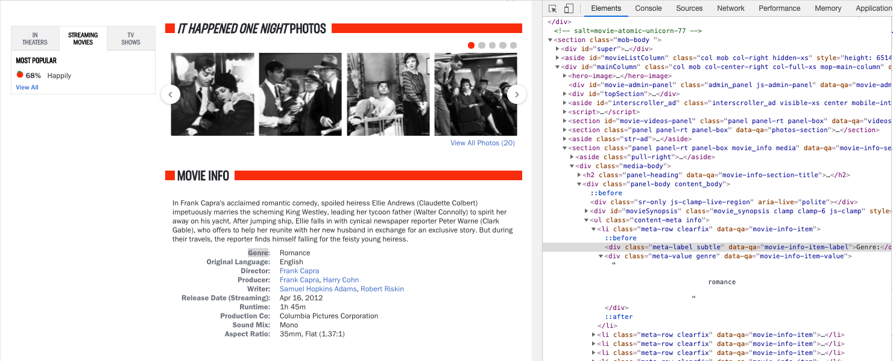
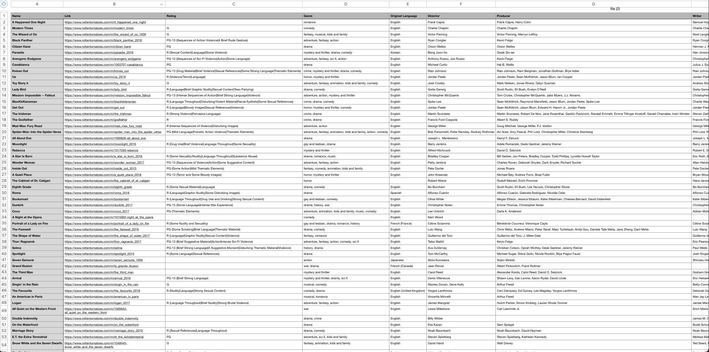
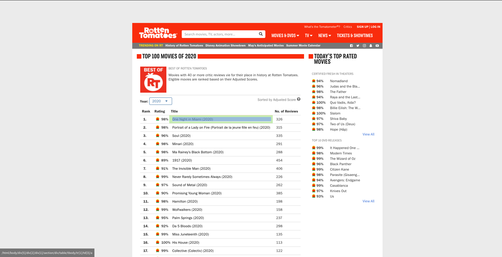
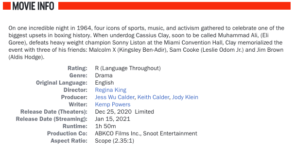
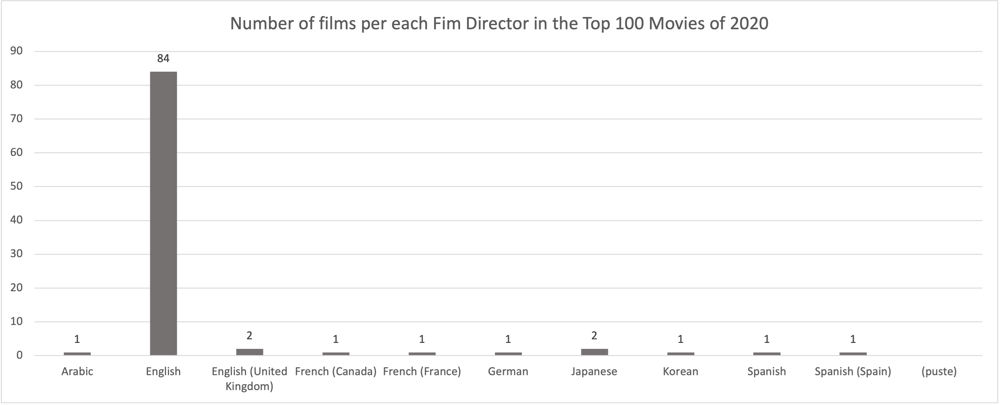
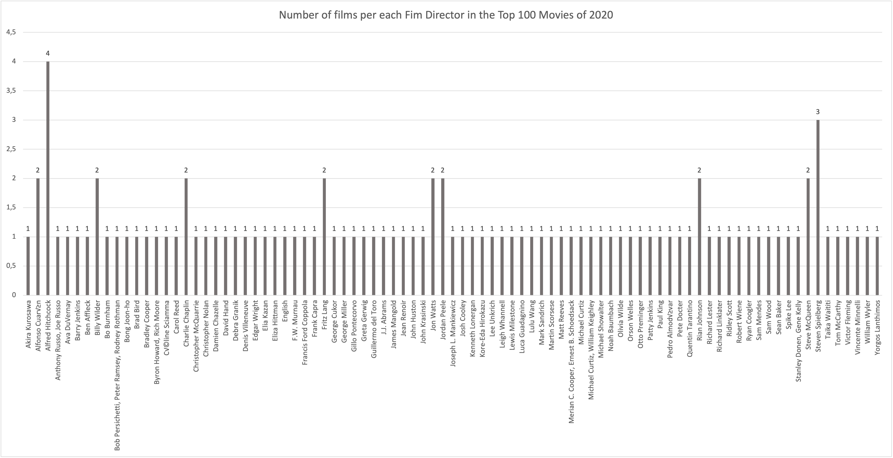

---
output:
  html_document: default
  word_document: default
  pdf_document: default
---


# Rotten Tomatoes WebScraper
**Project purpose:** Web Scraping and Social Media Scraping Project prepared at University of Warsaw, Data Science and Business Analytics Master's Degree Program in Faculty of Economic Sciences.&nbsp;

****
# Introduction
The internet is an absolutely huge source of data that we can collect in many ways and further analyze, but in reality, often, it turn out that Web Scraping is the only way to access data. There is a lot of information that is not available in convenient CSV format to export or easy-to-connect APIs.Stock prices, product details, sports stats, company contacts, movie reviews are the most popular data to scrap and thus we decided to build automated tools to scrap details of "Top 100 movies of 2020" at Rotten Tomatoes - a website presenting information, reviews and news from the world of film. Our WebScrapers were built with use with ``BeautifulSoup``, ``Scrapy``and ``Selenium`` frameworks. Using the above-mentioned mechanisms, we obtained the same movie details, like genre, rating, original language, Director, Producer etc. that we later shortly analyzed.

****
# GitHub repository structure
Our project repository includes all the required files arranged in a logical structure including the the imposed requirements according to which the project was prepared saved as ``project_rules.pdf``, described source codes for each of the individual WebScraper, the obtained output and a report detailing the mechanisms, their comparison and analysis of the results. 

TBD ADD PHOTO of a github structure and file names in the text!!!!!!!

****

# WebScraper mechanisms

## Beautiful Soup
The detailed described code for the first WebScraper can be seen in the file ```BeautifulSoup.py```. The tool uses libraries such as: ```BeautifulSoup```, ```Requests```, ```Pandas```, ```Time``` and regular expression package ```Re``` thus it is important to download them before running the code using ```pip install``` command. Libraries will be described in detail later, taking into account the functions in the tool that were obtained with their usage.

First, our BeautifulSoup WebScraper downloads ```Rotten Tomatoes``` ```https://www.rottentomatoes.com/top/bestofrt/``` with the list of TOP 100 movies of all time page using the Python ```Requests``` library. By ```GET``` request to a web server WebScraper downloads the HTML contents and then using ```BeautifulSoup``` library parses the document and extracts the text.



```{r}
url = "https://www.rottentomatoes.com/top/bestofrt/"
data = requests.get(url).text
soup = BeautifulSoup(data, 'html.parser')
```
Using ```find_all``` method WebScraper navigates a page , finds all the instances of a ```td``` tag and extracts all the ```href``` for each movie appending a previously created list.

```{r}
temp = [td.find('a', {'class': 'unstyled articleLink'}) for td in soup.find_all('td')]
for i in temp:
    if i is not None:
        href.append(i.get('href'))
```

Each link to a particular movie page has a similar structure, ```url = "https://www.rottentomatoes.com" + href"``` and thus ```href``` is used finding the links to the movie's page. For each link defined in this way, first an html copy of the page is requested using the link, then parsed and saved into previously created dictionary with movie names scrapped from ```Score Board``` with ```h1``` tag and attribute ```data-qa = "score-panel-movie-title"```.




Using loop WebScraper is visiting each link in the Top 100 movies and extracting details such as ```Genre```, ```Original Language```, ```Director```, ```Producer``` etc. which will later be used for elementary analysis. WebScraper navigates ```Movie Info``` section for each movie by its ```ul``` tag with class ```content-meta info``` and then iterates over each label and its value having ```data-qa``` attribute to finally saves extracted values and append dictionary to the ```Pandas``` dataframe. In the end dataframe is saved as ```CSV``` file and the time it tooks to scrape all data is displayed in the terminal window by using ```Time``` library.




Obtained output in a ```.CSV``` format.


## Scrapy

TBC

## Selenium
Similar to the previous WebScraper, for Selenium, described source code was also saved in the file ```Scrapy.py```. The design of this tool uses ```Selenium``` framework from which  ```Webdriver``` for Chrome is imported, as well as ```ActionChains``` to automate low-level interactions such as mouse movements,  ```NoSuchElementException``` to handle with data which may be not present on a page and dict subclass ```defaultdict``` from ```Colections``` that calls a factory function to supply missing values . Additionally, libraries such as ```Time```, ```Pandas``` and ```Re``` are used which are necessary to run the code.

The tool starts with creating a browser control object ```Webdriver``` and then enters the page using the ```GET``` method.

```{r}
# Chromedriver
gecko_path = '...'

# Rotten Tomatoes URL
url = 'https://www.rottentomatoes.com/'

# Setting driver
options = webdriver.chrome.options.Options()
options.headless = False
driver = webdriver.Chrome(options=options, executable_path=gecko_path)

# Actual Program
driver.get(url)
print(driver.page_source)

time.sleep(2)
```
Then using the webdriver and clicking on buttons defined by ```XPaths``` tool will locate  ```WebElements``` on the page: ```Movies >> Top Movies >> View All``` respectively and get all the movie links by accessing their ```href``` attribute and store in the predefined list.

```{r}
r = []
for i in range(100):
    path = "/html/body/div[5]/div[2]/div[1]/section/div/table/tbody/tr[" + str(i + 1) + "]/td[3]/a"
    d = driver.find_element_by_xpath(path).get_attribute("href")
    r.append(d)
```



Next, our WebScraper using loop is visiting each link in the Top 100 movies, extracts movie names navigating them by ```XPaths``` and store together with links in the dictionary which will be appended to the dataframe with previously extracted movie details. Finally dataframe is saved as ```.CSV``` file and the time it tooks to scrape all data is displayed in the terminal window.


****

# WebScrapers comparison

All three WebScrapers: ```Beautiful Soup```, ```Scrapy``` and ```Selenium``` scraped the same data stored in a ```.CSV``` file which contains 100 rows with observations for each movie and 15 columns with variables such as: 

```{r}
> ls(file)
 [1] "Aspect Ratio"             "Box Office (Gross USA)"   "Director"                
 [4] "Genre"                    "Link"                     "Name"                    
 [7] "Original Language"        "Producer"                 "Production Co"           
[10] "Rating"                   "Release Date (Streaming)" "Release Date (Theaters)" 
[13] "Runtime"                  "Sound Mix"                "Writer"    
    
```
Thus the goal of the project that all of the scrapers should scrap the same information from the domain of our choice was fulfilled.
Down below there is sample table of scraped data attached for each movie of Top100 movies of 2020.



****
# Basic Data Analysis

The main aim of this section is to show how our collected data of Top100 movies of 2020 from Rotten Tomatoes can be further analyzed.In the following bar charts showing based on scrapped data, we can see that the vast majority of the Top 100 movies in 2020 are originally in English. 



The next bar chart shows the number of films of Top100 movies of 2020 per each Film Director and as we can see Alfred Hitchcock and Steven Spielberg leads the list with 4 and 3 films respectively.



****

# Division of work

**Group Members:** Andrea Furmanek (345813), Divij Pherwani (430990)

| Task           | Contributors              |
|----------------|---------------------------|
| Beautiful Soup | Divij, Andrea             |
| Scrapy         | Divij                     |
| Selenium       | Divij                     |
| Github         | Andrea                    |
| Project Report | Andrea                    |


   